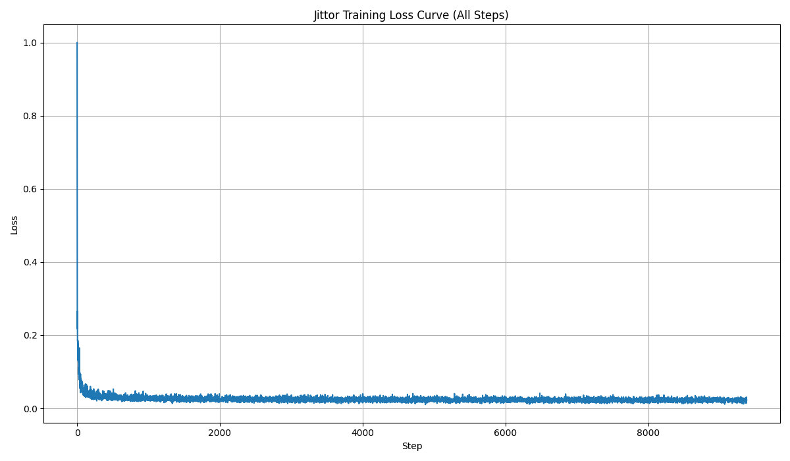
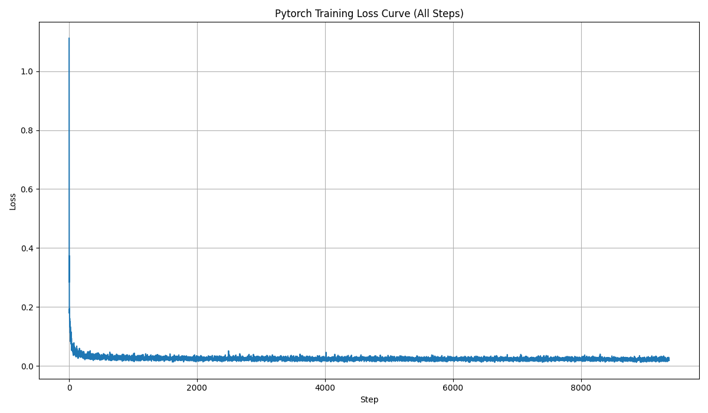
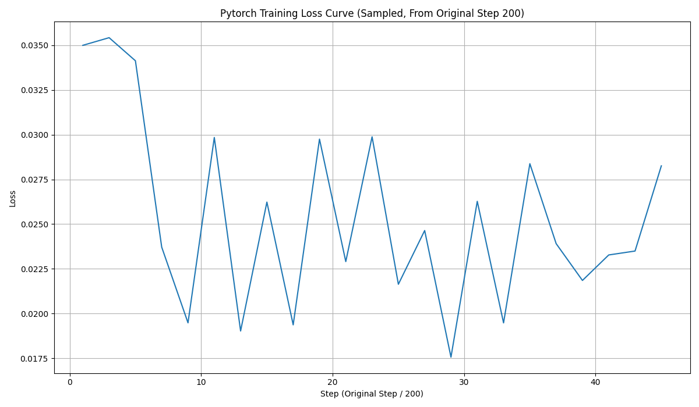
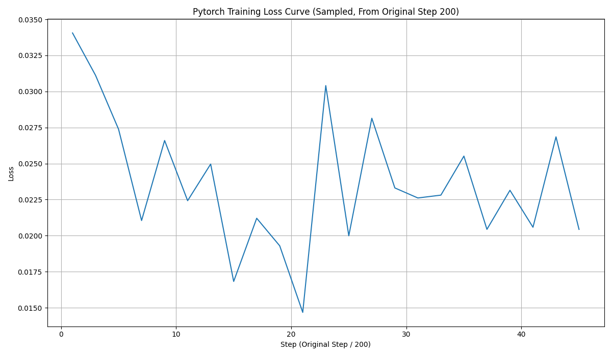
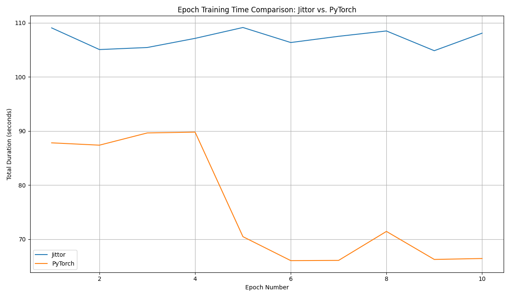
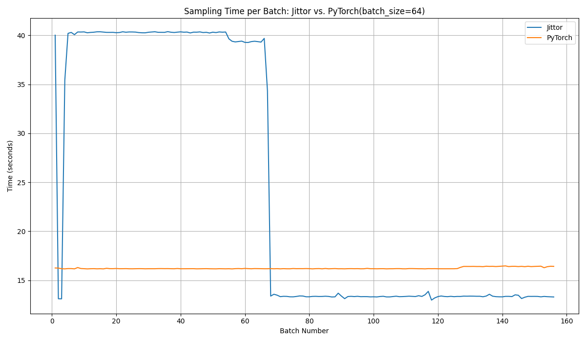

# DDPM论文用jittor框架的复现（用MNIST训练）
---

## 一、创建环境
运行以下命令：
```bash
conda create -n ddpm_jt python=3.8
conda activate ddpm_jt
cd Jittor_DDPM
pip install -r requirements.txt
```
即可创建成功该项目的可运行环境，下面可在该环境下进行采样和训练。

---


## 二、运行项目

在ddpm_jt环境下，输入如下命令进行训练和采样

### 训练

本项目采用MNIST数据集进行训练，并保存训练好的模型权重,运行以下命令可实现训练并保存模型权重。
```bash
python train.py
```
### 生成

采用上述训练的模型权重进行图像生成，可生成五中的图像网格以及渐进式采样的结果。
```bash
python sample.py
```
---
## 三、曲线对齐

### 3.1 loss曲线

  训练Jittor版本和Pytorch版本的DDPM过程中，本项目记录了二者训练过程每个step的loss曲线，设置batch_size=64,训练10个epoch，每个epoch训练938个step，训练曲线如下：
  
#### 整体loss曲线

Jittor:


Pytorch:


#### 每200个step取一个点的loss曲线

Jittor:


Pytorch:


观察loss曲线，我们可以得出如下结论：
- 二者的收敛值较为相近，都在0.25左右。
- 需要让二者收敛的step值也较为相近。

**详细记录的训练log如下：**

- [jittor_loss_step.txt](Jittor_DDPM/training_logs_jittor/loss_step.txt)  
- [pytorch_loss_step.txt](Pytorch_DDPM/training_logs_pytorch/loss_step.txt)


### 3.2 训练时间对齐曲线

本项目对pytorch和jittor的实现版本的每个epoch的训练时间进行记录，对比图如下：



可以看到：
- Pytorch版本的训练时间明显低于Jittor版本，每个epoch大约少25秒左右的时间。
- Jittor版本的训练时间相较于Pytorch明显更短.

**详细记录的训练时间log如下：**

- [jittor_train_time.txt](Jittor_DDPM/training_logs_jittor/train_time.txt)
- [torch_train_time.txt](Pytorch_DDPM/training_logs_pytorch/train_time.txt)
  
### 3.3 采样时间对比曲线

最后，本项目对pytorch和jittor的实现版本的每生成一个batch的所需时间进行记录，（batch_size=64），对比图如下：



- 非常反常的是，Jittor框架实现的采样一开始大约43秒，明显高于Pytorch实现，但生成的样本多了之后，生成时间出现了跃变，变得比Pytorch更快
- Pytorch的采样曲线明显比Jittor稳定很多

**详细记录的采样时间log如下：**

- [jittor_sample_time.txt](Jittor_DDPM/training_logs_jittor/sample_time.txt)
- [torch_sample_time.txt](Pytorch_DDPM/training_logs_pytorch/sample_time.txt)

---

## 四、分数对齐

  在这里，本项目测定了Pytorch版本和Jittor版本生成图片的FID分数和IS分数，FID分数用 `fid_score.py` 评估，IS用`is_score.py`来评估，用两个模型分别生成了10000张图片进行对照，结果如下（其中，FID对照的是MNIST测试集中的结果）：
| 框架    | FID 分数 | IS分数 |
| ------- | -------- | -------------------- |
| PyTorch | 7.0812  | 2.0161 ± 0.0211      |
| Jittor  | 12.4309  | 2.0657 ± 0.0137     |

IS（Inception Score）分数通过评估生成图像的多样性和生成质量，来评估模型性能，**越高越好**，而FID能够反映生成图像与真实图像的相似性，**越低越好**。
此表可以得到的结论如下：
- Jittor框架在FID分数上的表现明显优于Pytorch框架
- Jittor在IS分数上的表现略优于Pytorch

---

## 五、生成结果展示

### 5.1 8*8网格的生成结果

#### Jittor：

#### Pytorch：


### 5.2 渐进式采样效果展示

#### Jittor：

#### Pytorch：


---
